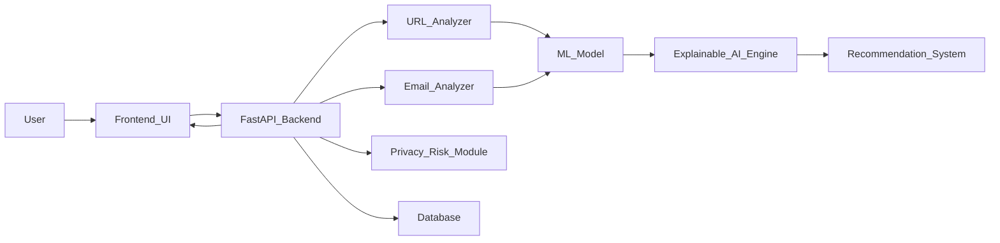

# aegisedu-ai-suite
🚀 AegisEDU AI – Explainable Digital Safety Companion

Explainable AI-powered cybersecurity assistant for students and educational institutions.

📌 Problem Statement

Students and educational institutions are increasingly vulnerable to:

Phishing attacks

Fake scholarship scams

Privacy leaks

Unsafe digital practices

Weak password usage

Suspicious email and link activity

Most existing cybersecurity tools are reactive and technical, offering alerts without clear explanations. Students often ignore warnings because they don’t understand the risk.

AegisEDU AI transforms cybersecurity from reactive defense to proactive digital education.

💡 Solution Overview

AegisEDU AI is an explainable AI-powered digital safety companion that:

Detects phishing and suspicious links

Identifies privacy risks

Flags unsafe digital behavior

Provides simple, human-readable explanations

Educates users about cybersecurity best practices

Instead of just blocking threats, the system explains:

Why is this risky?
What could happen?
What should I do next?

This makes cybersecurity understandable, actionable, and educational.

🏗 System Architecture

Use this Mermaid diagram in your README:

## 🏗 System Architecture

🧠 Architecture Explanation (Add Below Diagram)
🔹 Frontend UI

Web interface where students:

Paste suspicious links

Upload email content

Receive risk score + explanation

🔹 FastAPI Backend

Handles API requests, validation, authentication, and routing.

🔹 ML Model

Classifies:

Phishing URLs

Suspicious email patterns

Unsafe digital behavior indicators

🔹 Explainable AI Engine

Generates:

Clear risk explanation

Reason behind classification

Step-by-step preventive advice

🔹 Recommendation System

Suggests:

Change password

Enable 2FA

Avoid clicking link

Report suspicious sender

🔹 Database

Stores:

Risk history

User logs

Threat pattern trends

⚙️ Tech Stack

Python

FastAPI

Scikit-learn

NLP (for email analysis)

Explainable AI logic layer

SQLite / PostgreSQL

JWT Authentication

Uvicorn

🔍 Key Features

Phishing URL Detection

Suspicious Email Analysis

Explainable Risk Scoring

Privacy Risk Assessment

Personalized Cybersecurity Recommendations

Institutional Analytics Support

Secure Authentication

🎯 Impact

AegisEDU AI promotes:

Digital literacy awareness

Reduced phishing incidents

Proactive cybersecurity education

Data privacy protection

Safer academic digital environments

It transforms cybersecurity tools into educational AI companions.
